_fullstack engineer · typescript · javascript · go · kubernetes · ai_

---

---

## profile.yaml

---

## stack.txt

---

## projects

> ### [Moscow RolePlay](https://erlcrussia.com/moscowroleplay)
> The largest Russian-speaking roleplay server in [ER:LC Roblox](https://www.roblox.com/games/2534724415/Emergency-Response-Liberty-County) — a fully immersive roleplay experience.

> ### [ER:LC Россия](https://erlcrussia.com/)
> The community behind Moscow RolePlay and its ecosystem of projects — website, Discord bots and services.

> ### [ClueControl](https://cluecontrolbot.xyz)
> A Discord bot that automates roleplay servers — moderation, commands and admin tooling.

---

## contacts

---

## stats

 

 

---

<pre>
deploy small · improve daily · keep shipping.
</pre>

